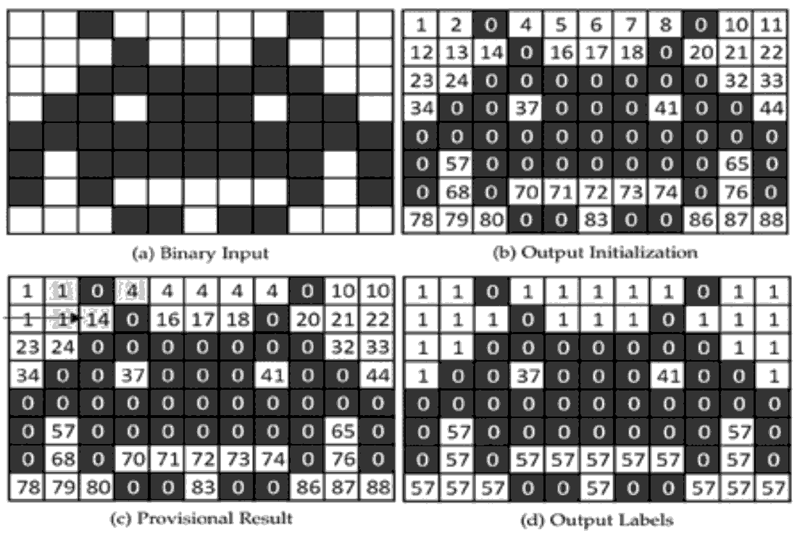
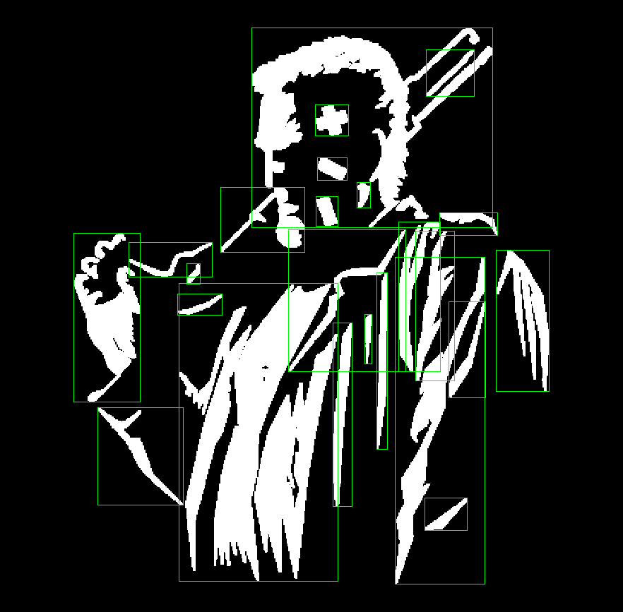

# Block-based Union Find (BUF)

This Connected Components Labeling (CCL) algorithm was shown as a GPU optimization solution introducing a block-based approach in the paper referenced:

S. Allegretti, F. Bolelli and C. Grana, "*Optimized Block-Based Algorithms to Label Connected Components on GPUs*" in IEEE Transactions on Parallel and Distributed Systems, vol. 31, no. 2, pp. 423-438, 1 Feb. 2020, doi: 10.1109/TPDS.2019.2934683.

* URL: https://ieeexplore.ieee.org/document/8798895

&nbsp;&nbsp;&nbsp;&nbsp;



## API

Just like done in the [cudalabel](https://github.com/armengot/cudalabel) repo, the CCL/BUF algorithm is tested here to obtain connected components at record speed, processed on the GPU.

The code downloaded from the [YACCLAB](https://github.com/prittt/YACCLAB) repo is placed here in the **bufcore.cu** file (copied&pasted), and a C++ wrapper class has been added, to which I have incorporated the extraction of bounding boxes.



## Usage

As simple as seen before:

```
cv::cuda::GpuMat img,glabels;
cv::Mat labels;
bufapi b;

// BUF api usage
b.img(img);    
glabels = b.getlabels();    
glabels.download(labels);    

// getting bounding boxes
std::vector<cv::Rect> boxes = b.getboxes();
```

## Times

GOAL: The whole 4k (RGB) image must be processed in less than 33.33ms if the total video rate must be around 30FPS.

Allegretti et al. provide us with an algorithm to obtain the labeled image in the range of 0–1 ms; my added layer for extracting the bounding boxes is not as efficient, but overall it does not exceed the required maximum.

```
[BUF] processing image [2880x2160] with sample0.jpg took    17.324 ms.
[API] getting boxes    [2880x2160] with sample0.jpg took   167.364 ms. TOTAL: 184.688 ms

[BUF] processing image [2880x2160] with sample1.jpg took     0.363 ms.
[API] getting boxes    [2880x2160] with sample1.jpg took     4.148 ms. TOTAL: 4.511 ms

[BUF] processing image [2880x2160] with sample2.jpg took     0.383 ms.
[API] getting boxes    [2880x2160] with sample2.jpg took    10.684 ms. TOTAL: 11.067 ms

[BUF] processing image [2880x2160] with sample3.jpg took     0.365 ms.
[API] getting boxes    [2880x2160] with sample3.jpg took     4.092 ms. TOTAL: 4.457 ms

[BUF] processing image [2880x2160] with sample4.jpg took     0.437 ms.
[API] getting boxes    [2880x2160] with sample4.jpg took    12.283 ms. TOTAL: 12.72 ms

[BUF] processing image [2880x2160] with sample5.jpg took     0.358 ms.
[API] getting boxes    [2880x2160] with sample5.jpg took     4.232 ms. TOTAL: 4.59 ms

[BUF] processing image [2880x2160] with sample6.jpg took     0.457 ms.
[API] getting boxes    [2880x2160] with sample6.jpg took    12.543 ms. TOTAL: 13 ms

[BUF] processing image [2880x2160] with sample7.jpg took     0.475 ms.
[API] getting boxes    [2880x2160] with sample7.jpg took     4.734 ms. TOTAL: 5.209 ms

[BUF] processing image [2880x2160] with sample8.jpg took     1.816 ms.
[API] getting boxes    [2880x2160] with sample8.jpg took    12.188 ms. TOTAL: 14.004 ms

[BUF] processing image [2880x2160] with sample9.jpg took     0.568 ms.
[API] getting boxes    [2880x2160] with sample9.jpg took     6.643 ms. TOTAL: 7.211
```